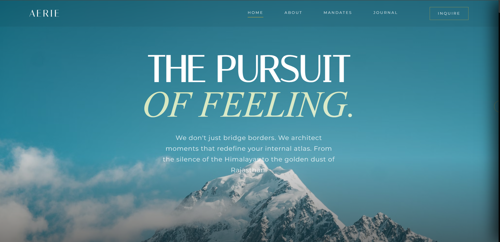

# 🌍 AERIE | Modern Travel Blog Showcase

**The Pursuit of Feeling — A Vision for Modern Travel Storytelling.**

AERIE is a premium, minimalist web template designed to redefine how travel is documented. Moving away from cluttered, ad-heavy blog layouts, this project showcases a **"Luxury Mandate"** aesthetic—blending raw exploration grit with high-end execution.



[**Live Demo**](https://amantshekar.github.io/Travel-blog-SIte-Template/)

---

## ✨ The Vision
This template is a showcase of what a modern travel blog should be: **Minimalist, authoritative, and emotionally driven.** Instead of a traditional blog, it focuses on:

* **The Architect Persona:** Treating the traveler as a curator, not just a visitor.
* **The Canvas:** High-impact, full-width imagery integrated with geospatial data (GPS coordinates).
* **The Spectrum:** Categorizing travel by the *feeling* (Solitude, Freedom, Legacy) rather than just a checklist.

---

## 🛠️ Tech Stack
This is a lightweight, high-performance frontend showcase built with:

* **HTML5 & CSS3:** Custom grid systems and editorial-style layouts.
* **JavaScript:** For smooth navigation and scroll interactions.
* **Typography:** Editorial-grade serif and sans-serif pairings for a premium magazine feel.

---

## 🚀 Key Features
* **Geospatial Integration:** Real-world coordinates (e.g., 26.9124° N, 75.7873° E) integrated into UI elements.
* **Editorial Layout:** Magazine-style grids that prioritize whitespace and readability.
* **Responsive Design:** Fully optimized for high-resolution desktops and mobile browsing.
* **"Dubai Standards" Branding:** A futuristic, high-contrast aesthetic designed for global elite storytelling.

---

## 📥 Getting Started
This is a **showcase template**. To use it or explore the code:

1.  **Clone the repository:**
    ```bash
    git clone [https://github.com/AmanTShekar/Travel-blog-SIte-Template.git](https://github.com/AmanTShekar/Travel-blog-SIte-Template.git)
    ```
2.  **Launch the site:**
    Simply open `index.html` in any modern web browser.
3.  **Customize:**
    Swap out the assets in the imagery sections and update the "Mandates" text to reflect your own journey.

---

## 🖋️ Author
**Aman T Shekar**
*Computer Science & Engineering | Full-Stack Developer* 

---
